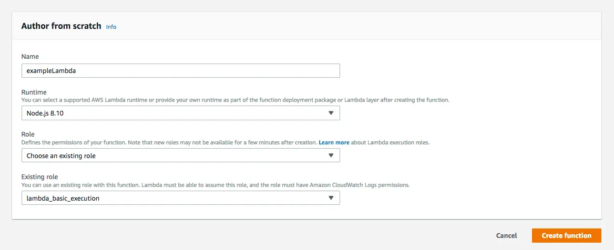
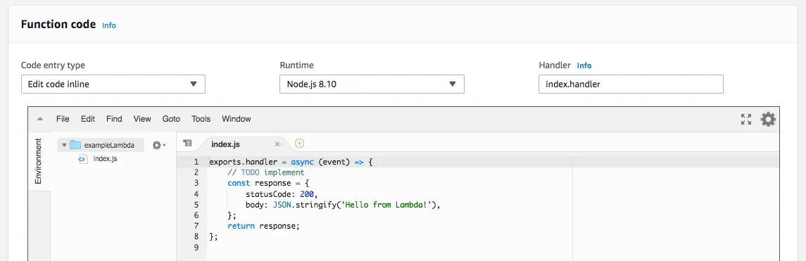
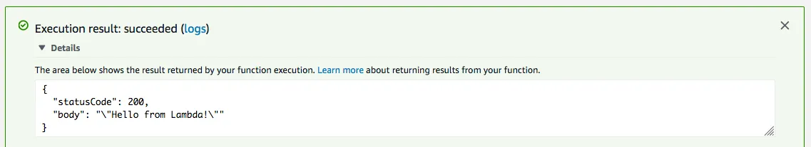

## Using the AWS Console
1. Login to AWS, and click on the “Services” menu in the top, left-hand corner of the navigation bar.
2. Navigate to Lambda by either typing “Lambda” into the search bar or finding Lambda in the list of “Compute” services.
3. From the “Dashboard” or the “Functions” webpage, click on the “Create function” button.
4.  With “Author From Scratch” selected, fill out the form with a function name, the node.js 8.10 runtime, and a role. The role determines the permissions the lambda has to access other AWS services.

5. Choose “Create a custom role”. This option by default will open a new window and fill in the default options for the new role. The default option is called “lambda_basic_execution”, which permits lambdas that use this role to interact with the Cloudwatch service for logging purposes. In the future, you will not need to recreate this role. You can simply select “Choose an existing role” in the third form field and “lambda_basic_execution” in the fourth form field.
6. Click “Create function”.
7. Now the lambda has been configured. You can scroll down to the “Function code” and edit the function. Please put the code from  [handler.js](https://github.com/rnovykov/aws-lambda-secrets-management/blob/main/lambda_kms/handler.js) file into the console

8. And that’s it! Your lambda is ready to be called.
9. To run your lambda function, you will need to create a test event by clicking the “Test” button at the top of the webpage. Once created, your test event should be selected. Click “Test” again, and view the execution result by clicking “Details” in the message that appears.
