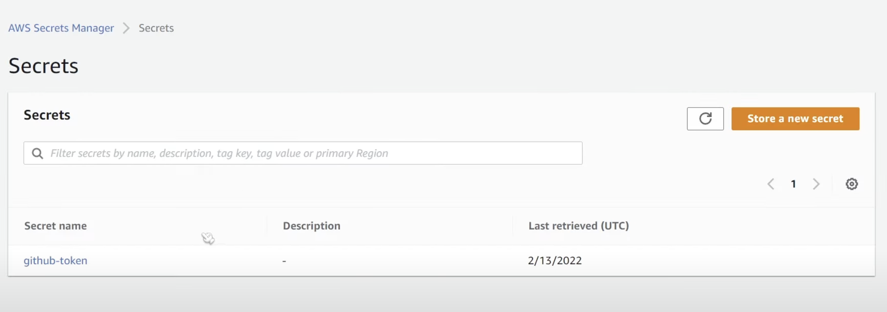
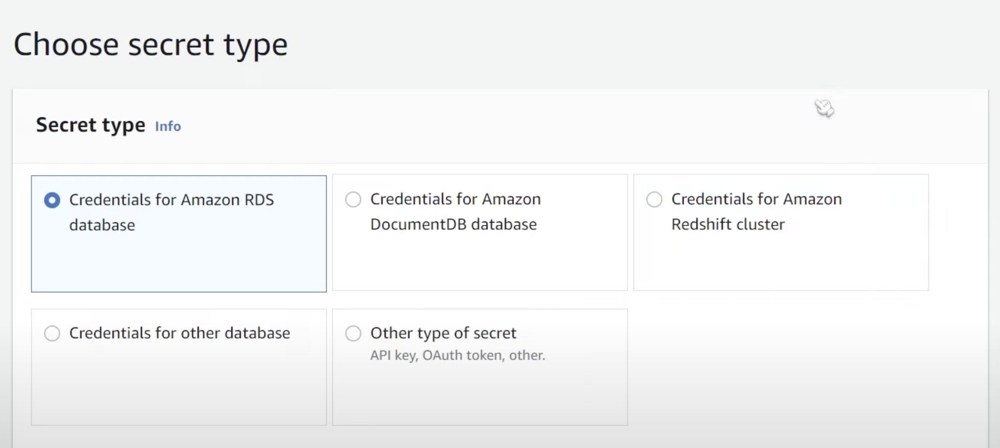
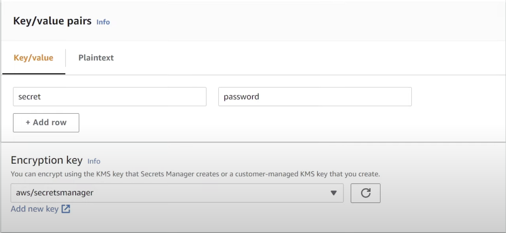
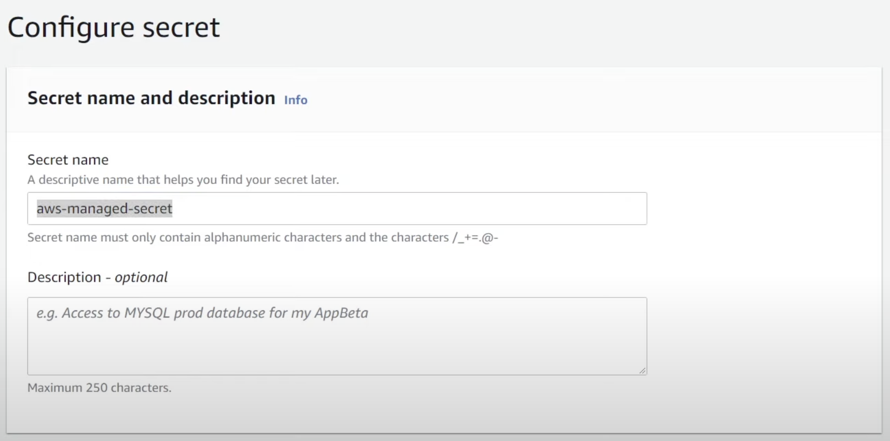
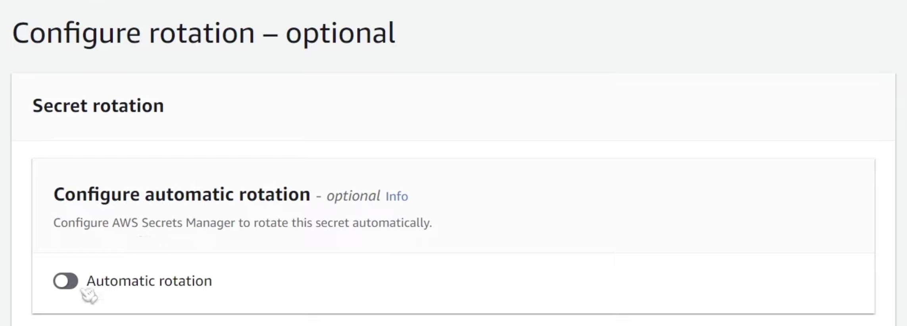

## Using the AWS Console
# Creating AWS Lambda
You can use tutorial [README.MD](https://github.com/rnovykov/aws-lambda-secrets-management/blob/main/lambda_kms/README.md) to create lambda function.
Please use [handler.js](https://github.com/rnovykov/aws-lambda-secrets-management/blob/main/secrets_manager/handler.js) code for this case

# Creating Our Secret
To create a secret, search for the Secrets Manager service in the AWS console. The home screen should look like this:

Before we begin, note that there is a 40-cent cost per month for each secret you store within Secrets Manager.

However, if this is your first time using Secrets Manager on your AWS account, you are automatically eligible for the free trial of the service. This allows you to create, retrieve, and rotate secrets for 30 days without being charged a penny.

Note that the 30 day period starts when you create your first secret on your account. There’s nowhere in the AWS console (that I know of at least) where you can see the expiry date so you may want to write it down.

Click “Store a new secret” and select the secret type that you want to store. If you’re using Amazon RDS, DocumentDB, or Redshift, I highly recommend selecting one of those options because you will also get automatic secret rotation as an added benefit. This adds an extra layer of security on top of your storage.

However, if you’re storing a secret value in plain text, like an API key for GitHub, you’ll want to use the “Other type of secret” option. In this demo, we will use the “Other type of secret”.

# Key-Value Pairs
Once you’ve chosen the “Other type of secret” option, you’ll see options asking you to set key-value pairs.

You can store a JSON object with the key name and key password, or you can just put it in plain text for a single row. For this case, I’m going to use the dialogue box and call my key “secret” and value “password” as seen in the image below.

You’ll also notice you have the option of specifying an Encryption key. When you first create an AWS account, AWS automatically creates KMS Keys which will manage the key used to encrypt your data.

You can choose to use the AWS managed key or create your own which you can assign permissions to. For now, we’ll leave this as using the AWS managed KMS key.

Hit “Next” now, and let’s call the secret aws-managed-secret. I’d recommend putting this on your clipboard so you don’t forget it and then hit “Next.”

On the next page, you’ll be asked whether you’d like to enable key rotation as seen below. This is an optional feature that can allow you to automatically rotate the contents of your secret on certain intervals. You can choose to enable this but be warned you’ll need to implement a Lambda Function that handles the rotation. Tread carefully.

Proceed through the wizard and complete creating your secret. Note the ARN (Amazon Resource Name) of your secret on the summary page. Keep this value handy as we’ll need it when we implement the code for our Lambda function.